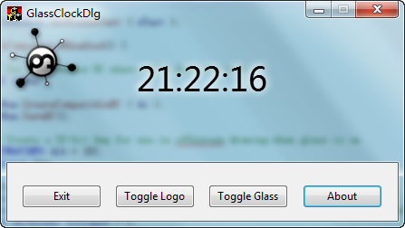

#### window系统上毛玻璃效果

```c++
DwmExtendFrameIntoClientArea
DrawThemeTextEx
DwmIsCompositionEnabled
```


This code accompanied the article:
  Vista Goodies in C++: Using Glass in Your UI
available at this URL:
  http://www.codeproject.com/winfx/VGGlassIntro.asp
written by:
  Michael Dunn (acidhelm@gmail.com)
Release date:
  October 2, 2006

If you're looking for the license terms that this code is released under,
see the file "LICENSE.txt".

If you run into problems with building or using the code, please check the
article's web page (listed above) to see if there are any updates to the article
or the code. Also, check the article's discussion forum (located at the bottom
of the article's web page) to see if your problem has already been found and
solved. If not, post a message to the article's forum, and I'll see what I can
do for you.
I prefer that you post to the article's forum, instead of emailing me directly,
so that your question can be visible to everyone. Also, if we end up solving
your problem, the solution will also be visible and will help others.


##### 截图

<p align="center">

</p>


